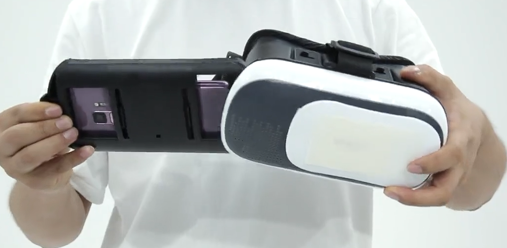

---
title:  "[왕초보도 할 수 있는 VR] 타워디펜스 8 - VR 연동"
excerpt: "unity3d, vr, ui"

categories:
  - UnityExample
tags:
  - [unity3d, vr, ui]

toc: true
toc_sticky: true
 
date: 2022-01-12 
last_modified_at: 2023-06-05
---  

***  
<a href="https://www.gseek.kr/member/rl/studyRoom/studyRoomMain.do?courseSeq=2069&courseCsSeq=1&stuSeq=&subjSeq=5&pageNum=1">VR 강의</a>

Unity version 2018.1.1f1

### VR 준비물

테스트를 위해서 스마트폰과 VR 글라스 같은 케이스를 준비한다.  

 

 

이렇게 스마트폰으로 VR 게임을 플레이한다면 공격을 입력할 수 있어야한다. 

장비에 버튼 기능이 있다면 지금 제작한 게임 방식으로 플레이가 가능하다. 하지만 입력 기능이 없는 장비를 위해서 입력 방식을 몇초간 주시 또는 화면 이동시 등 자동 공격 기능을 추가할 필요가 있다.  

 

### VR 컨버팅

구글 카드보드 플레이 기준

<a href="https://github.com/googlevr/gvr-unity-sdk/releases">구글 카드보드 SDK 다운로드</a>

GoogleVRForUnity_1.200.1.unitypackage 를 다운 받고 파일을 실행시켜 유니티 프로젝트에 Import한다.

설치가 완료되면 현재 프로젝트에 GoogleVR 폴더가 생긴다. 

#### 모바일용 컨버팅

* 플랫폼 전환

	File > Build Settings > Platform > Android 플랫폼을 변경하고 Switch Flatform을 실행한다. 

* Player Settings	

	플랫폼 전환 완료 후

	* XR Settings

		Player Settings > Inpspector 창에서 XR Settings 옵션을 설정한다.  

		Virtual Reality Supported 체크 후

		Virtual Reality SDKs > + 를 클릭해서 지원할 기기(Cardboard)를 선택한다.  

	* Other Settings

		Identification > Minimum API Level > Android 4.4 'KitKat' (API level 19) 로 변경

		카드보드 VR이 지원하는 안드로이드 버전이 19부터이다.

 

### 프로젝트 설정

Assets > GoogleVR > Prefabs 폴더에 있는 GvrEditorEmulator 프리팹을 하이어라키창에 추가한다.  

이 프리팹을 통해서 VR기기로 실행시 카메라 회전을 VR용으로 볼 수 있게 한다.

이후 PC에서 게임을 실행해보면 카메라의 위치가 0, 0, 0 으로 변경된다.

* 카메라 세팅

	Tower > Main Camera > Cam Rotate 컴포넌트를 비활성화 한다.  

그리고 다시 플레이 해보면 마우스를 움직여도 카메라가 회전되지 않는데 여기서 alt키를 누른채 움직이면 화면이 움직이는걸 확인할 수 있다.  

설치한 SDK에서 지원하는 기능으로 헤드 트래킹으로 카메라를 움직이게 한다. 

alt + 마우스 : 요, 피치

ctrl + 마우스 : 롤 

#### 카메라 문제

카메라가 0, 0, 0으로 강제 이동하는 문제를 해결하기 위해서 카메라를 기준으로 다른 모든 오브젝트들을 이동 시킨다. 

**팁**

다른 모든 오브젝트를 카메라를 기준으로 옮기는 방법

우선 Tower의 자식으로 되어있는 Main Camera를 자식에서 해제한다. 

그리고 Main Camera이외의 모든 오브젝트를 Main Camera의 자식으로 넣은 다음 Main Camera의 위치를 0, 0, 0으로 변경한다.  

다시 Main Camera의 모든 자식을 꺼내고 실행해보면 카메라 시점이 원하는대로 고정된걸 확인할 수 있다.  

 

#### 드론 문제

카메라를 고치고 나면 이제 드론이 하늘을 날아다니게 되는 문제가 발생한다. 그 이유는 드론이 네비메시를 따라서 이동하기 때문인데 이미 구워진 경로대로 움직이므로 다시한번 네비메시를 구워준다.  

Window > AI > Navigation > Bake 탭에서 Bake 실행

 

 